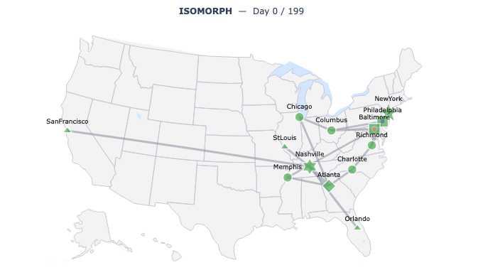

# ISOMORPH (modified fork)

> **This is a modified fork of [tuhinsahai/ISOMORPH](https://github.com/tuhinsahai/ISOMORPH), not the official release.**
> The simulator, datasets, and evaluation code are by the original authors (Zhang et al., 2026; [arXiv:2605.12768](https://arxiv.org/abs/2605.12768)). Please cite their paper. This fork changes only the two items listed under [Modifications in this fork](#modifications-in-this-fork).

A digital twin of a multi-echelon logistics network, plus a zero-shot
foundation-model evaluation harness. The upstream repository accompanies the
paper *ISOMORPH: A Supply Chain Digital Twin for Simulation, Dataset
Generation, and Forecasting Benchmarks*:
https://arxiv.org/pdf/2605.12768

Upstream demo (runs the original simulator; it does not include this fork's changes):

<a href="https://huggingface.co/spaces/HyeminGu/ISOMORPH-demo"><font color="red"><strong>Interactive simulation environment</strong></font> for stress-testing supply chains under demand shocks, disruptions, and cascading transport congestion</a>

[](https://huggingface.co/spaces/HyeminGu/ISOMORPH-demo)

---

## Modifications in this fork

This fork adapts the simulator for policy-comparison experiments that need runs shorter than 7,300 days and a continuous capacity-severity setting. The model equations, network, demand process, and control rules are unchanged. The changes are in `simulator/`; `git diff upstream/main...main -- simulator/` lists exactly which scripts differ from upstream.

| # | Modification | Upstream behavior | Fork behavior | Designed to leave upstream output unchanged at |
|---|--------------|-------------------|---------------|-----------------------------------------------|
| 1 | Global-shock durations scale with run length | The global-shock generator draws 5 to 11 events of 180 to 1,100 days regardless of `--days`. At short horizons the events cover most of the run. | Event durations are multiplied by `--days / 7300`. | `--days 7300` (factor 1.0) |
| 2 | `--containers_scale` acts on continuous container volume | The scale multiplies the integer `num_containers_per_day` and is rounded, so nearby values can produce identical output. Last-mile edge capacity is then recalibrated to a fixed margin over demand, which overrides the scale on those two edges. | The scale multiplies `container_volume` after last-mile calibration, and the routing-weight cache is refreshed for all edges. | `--containers_scale 1.0` |

### Compatibility with upstream

- Both modifications are designed to leave the released baseline unchanged (`--days 7300`, `--containers_scale 1.0`). The check at the end of this section compares this fork with upstream directly.
- The Edge-cap sweep (`--containers_scale` 0.3, 0.6, 1.5, 2.5) will differ from the upstream datasets, because modification 2 changes how the knob acts. Use the upstream repository to regenerate those datasets.

### Usage note for modification 2

Last-mile capacity is set to about (1.20 / 0.93) × `containers_scale` times demand, so demand exceeds capacity below `containers_scale` = 0.93 / 1.20 ≈ 0.775. Convergence to a steady state slows between about 0.75 and 0.80.

### Checking equivalence with upstream

```bash
git clone https://github.com/tuhinsahai/ISOMORPH.git ../ISOMORPH_upstream

python ../ISOMORPH_upstream/simulator/Supplychaingeo_item50.py \
    --days 7300 --seed 2025 --pipeline_mult 7 \
    --out_dir /tmp/up_baseline --scenario_name baseline

python simulator/Supplychaingeo_item50.py \
    --days 7300 --seed 2025 --pipeline_mult 7 \
    --out_dir /tmp/fork_baseline --scenario_name baseline

diff -rq -x scenario.json /tmp/up_baseline /tmp/fork_baseline && echo IDENTICAL
```

### Provenance

Forked from `tuhinsahai/ISOMORPH`. Modifications by Niloy Dey. Code is MIT-licensed as upstream; see [Licence](#licence).

---

## Upstream updates

*Entries below are copied from the upstream repository. They describe upstream code, not this fork's changes.*

**08/05/2026** — Extended `simulator/Supplychaingeo_item50_v2.py` with three
scenario-control knobs and two new reproducible edge-cut example datasets.

| Extension | What it adds | Key knobs |
|-----------|--------------|-----------|
| Targeted edge cut | Zero the capacity of a chosen set of directed edges during a fixed day window, with an optional linear post-cut restore ramp | `--disable_edges`, `--disable_from_day`, `--disable_days`, `--restore_ramp_days` |
| Per-tier (s,S) overrides | Independent (s,S) scale per network tier (source, hub, T2–T5), layered on top of the global `--ss_scale` | `--ss_src`, `--ss_hub`, `--ss_tier2`, `--ss_tier3`, `--ss_tier4`, `--ss_tier5` |
| Configurable SKU count | Trim the active catalog to the first N of 50 SKUs for small-catalog experiments | `--n_items` |

The reservoir extension is now opt-in: omitting `--prod_rate_per_item` keeps plain
base-simulator source semantics (no RNG drift). A `--source_production` shortcut
sets the pure-faucet model (unlimited reservoir cap). Two edge-cut scenario
datasets — ripple disruption and bottleneck migration — are reproducible with
the commands in [§6](#6-extended-simulation-physical-realism-extensions).

**08/05/2026** — Added `simulator/Supplychaingeo_item50_v2.py`: an extended C=50
simulator with four physical-realism knobs on top of the baseline logic.

| Extension | What it adds | Key knobs |
|-----------|--------------|-----------|
| Supplier disruption | Bernoulli-onset outages of fixed length at each source node; disrupted sources skip replenishment and reservoir refill | `--disruption_p_onset`, `--disruption_length_days` |
| Finite source supply | Per-source raw-material reservoir that refills at a production rate and caps at a maximum level; outbound orders are capped at available reservoir units | `--prod_rate_per_item`, `--reservoir_cap_per_item`, `--init_frac` |
| Finite warehouse capacity | Each intermediate node has a total volumetric cap; replenishment orders are capped to remaining headroom | `--warehouse_cap_scale` |
| Stochastic edge transit | Per-shipment multiplicative Gaussian noise on the deterministic transit-time sum; clipped to ≥ 1 day | `--edge_tt_std_frac` |

Setting all extension knobs to their defaults (disruption off, reservoir off, no
warehouse cap, zero noise) exactly reproduces the base simulator.
Two additional output files are written: `reservoir_history.csv` and `source_availability.csv`.
See [§6](#6-extended-simulation-physical-realism-extensions) for usage.

---

The release contains four components:

1. The simulator that produces every released dataset
   (`simulator/`).
2. Zero-shot rolling-origin inference and metric scripts for four TSF
   foundation models: Chronos, Moirai, TimesFM, Lag-Llama (`eval/`).
3. The Latin-hypercube parameter-uncertainty pipeline used for the
   forward-UQ figures (`uq/`).
4. Validation and figure scripts (bullwhip, baseline overview, scenario
   family) (`analysis/`).

The released datasets are distributed alongside this code in a sibling
`data/` directory; see *Data layout* below.

## Layout

```
Isomorph_release/
├── README.md
├── requirements.txt
├── simulator/
│   ├── Supplychaingeo_item50.py     # canonical simulator, C=50 catalogue
│   ├── Supplychaingeo_item50_v2.py  # extended: disruption + reservoir + warehouse cap + tt noise + edge cut + per-tier ss + n_items
│   ├── Supplychaingeo_item200.py    # same logic, C=200 catalogue
│   └── derive_edge_files.py         # post-process: edge_list.csv + utilisation
├── eval/
│   ├── {chronos,moirai,timesfm,lagllama}_runner.py   # model wrappers
│   ├── {chronos,moirai,timesfm,lagllama}_run.py      # CLI driver per model
│   ├── data_utils.py                # load_dataset, iter_test_windows
│   ├── metrics.py                   # per-channel MAE/RMSE at horizons
│   └── gift_style_mase.py           # paper Tables 3 / 13 aggregator
├── uq/
│   ├── sample_lhs.py                # K=20 LHS over (phi_AR, rho_G, rho_B)
│   └── plot_uq_envelope.py          # forecast-envelope figure
└── analysis/
    ├── bullwhip_analysis.py         # paper Tables 2 and 18
    ├── make_baseline_overview.py    # paper Figure 6
    └── make_scenario_family.py      # paper Figure 3
```

## Data layout

The released datasets live in a sibling `data/` directory and are
referenced by every CLI driver via `--root <data dir>`:

```
data/
├── output_item50/                # baseline C=50
├── output_item200/               # baseline C=200
├── output_mixture/<scenario>/    # 27 scenario rollouts at C=50
└── output_uq/
    ├── manifest.csv              # K=20 LHS configurations
    └── perturb_k01 ... k20/      # one rollout per LHS sample
```

Each rollout writes:
- `daily_records.csv`, `shipments.csv`, `service_summary.csv`
- `inventory_history.csv`, `backlog_history.csv`, `intransit_history.csv`
- `demand_signals.npy`, `demand_signals_cols.txt`
- `scenario.json` (the exact CLI knobs used)
- optional: `edge_list.csv`, `edge_utilisation.npy`, `edge_saturation.npy`
  (produced by `simulator/derive_edge_files.py`)
- optional (v2 only): `reservoir_history.csv`, `source_availability.csv`
  (written by `simulator/Supplychaingeo_item50_v2.py`)

## Conventions

- One step is one day. The released horizon is `T = 7,300`.
- All released runs use seed `2025`.
- This fork: `--days` values other than 7,300 rescale the global-shock durations (modification 1). At 7,300 the scale factor is 1.0.

---

## 1. Generate the baseline datasets

C = 50 items:
```bash
python simulator/Supplychaingeo_item50.py \
    --days 7300 --seed 2025 \
    --pipeline_mult 7 \
    --out_dir data/output_item50 \
    --scenario_name baseline
```

C = 200 items:
```bash
python simulator/Supplychaingeo_item200.py \
    --days 7300 --seed 2025 \
    --pipeline_mult 7 \
    --out_dir data/output_item200
```

Both use horizon `T = 7,300` and pipeline multiplier `m = 7`. The
released datasets ship with `m = 7`; the simulator's built-in default
is `m = 0`.

## 2. Generate the scenario sweeps

The mixture set covers the six one-at-a-time sweeps of the paper plus
two compound scenarios. All sweeps run on the C=50 simulator. Each
named scenario is reproduced by overriding the corresponding knobs
below; the remaining knobs stay at their baseline.

| Sweep      | Knobs perturbed                              | Settings                                              |
|------------|----------------------------------------------|-------------------------------------------------------|
| Drift      | `--phi_lo`, `--phi_hi`                       | `0.71, 0.86, 0.96, 0.99, 0.9993`                      |
| Shock      | `--shock_count_scale`, `--shock_height_scale`| `(0,1), (0.5,0.7), (1,1), (2,2), (3,4)`               |
| Burst      | `--burst_rate_scale`, `--burst_height_scale` | `(1,1), (1.5,2), (2,3), (3,4), (5,8)`                 |
| Edge cap   | `--containers_scale`                         | `0.3, 0.6, 1.0, 1.5, 2.5`                             |
| Buffer     | `--ss_scale`                                 | `0.1, 0.2, 0.5, 0.75, 1.0`                            |
| Lead time  | `--leadtime_scale`                           | `1.0, 2.0, 5.0, 10.0, 20.0`                           |

> **Fork note.** In this fork the Edge-cap sweep (`--containers_scale` 0.3, 0.6, 1.5, 2.5) will differ from the upstream datasets, because modification 2 changes how the knob acts (see [Modifications in this fork](#modifications-in-this-fork)). Use the upstream repository to regenerate those datasets.

Two compound scenarios used in the foundation-model evaluation:

| Scenario        | Overrides                                                              |
|-----------------|------------------------------------------------------------------------|
| `chaos_compound`| `phi_lo=0.96, phi_hi=0.98, shock_count_scale=3, shock_height_scale=4`  |
| `chaos_burst`   | `phi_lo=0.96, phi_hi=0.98, burst_rate_scale=3, burst_height_scale=4`   |

Example (drift_mid):
```bash
python simulator/Supplychaingeo_item50.py \
    --days 7300 --seed 2025 --pipeline_mult 7 \
    --phi_lo 0.95 --phi_hi 0.97 \
    --out_dir data/output_mixture/drift_mid \
    --scenario_name drift_mid
```

## 3. Foundation-model zero-shot evaluation

Each model has a thin wrapper (`*_runner.py`) and a CLI driver
(`*_run.py`) that performs rolling-origin inference and writes
per-channel metrics. All four models share `L=512`, `H=30`,
`stride=30`, `num_samples=20` (TimesFM uses its deterministic quantile
head). The paper's MASE is the GIFT-Eval-style aggregate computed by
`eval/gift_style_mase.py`.

Run one model on one dataset:
```bash
python eval/chronos_run.py \
    --root data \
    --dataset output_item50 \
    --model_id amazon/chronos-t5-base \
    --L 512 --H 30 --stride 30 \
    --num_samples 20 --channel_batch 16 \
    --out results/eval/baseline_and_scenarios
```

Substitute `chronos_run.py` with `moirai_run.py`, `timesfm_run.py`, or
`lagllama_run.py`, and the corresponding `--model_id`:

| Driver           | `--model_id`                                       |
|------------------|----------------------------------------------------|
| `chronos_run.py` | `amazon/chronos-t5-base`                           |
| `moirai_run.py`  | `Salesforce/moirai-1.1-R-base`                     |
| `timesfm_run.py` | `google/timesfm-2.0-500m-pytorch`                  |
| `lagllama_run.py`| `time-series-foundation-models/Lag-Llama`          |

To run on a scenario rollout, point
`--dataset output_mixture/<scenario>` and pass
`--label <scenario>`.

Aggregate to GIFT-Eval-style MASE (paper Tables 3 and 13):
```bash
python eval/gift_style_mase.py
```

## 4. Forward UQ (forecast envelopes)

Sample K=20 demand-side LHS configurations:
```bash
python uq/sample_lhs.py
```

This writes `data/output_uq/manifest.csv` with three knobs per row
(`phi_AR`, `rho_G`, `rho_B`). Run the simulator once per row:
```bash
while IFS=, read -r k phi rho_G rho_B; do
    [ "$k" = "k" ] && continue
    python simulator/Supplychaingeo_item50.py \
        --days 7300 --seed 2025 --pipeline_mult 7 \
        --phi_lo "$phi" --phi_hi "$phi" \
        --shock_count_scale "$rho_G" --shock_height_scale "$rho_G" \
        --burst_rate_scale  "$rho_B" --burst_height_scale  "$rho_B" \
        --out_dir "data/output_uq/perturb_k$(printf %02d $k)" \
        --scenario_name "perturb_k$(printf %02d $k)"
done < data/output_uq/manifest.csv
```

Run zero-shot inference on each rollout. Use the same `*_run.py`
drivers as in §3, but point `--dataset` at the per-perturbation
directory and override `--out` to a UQ-specific path:
```bash
for k in $(seq -f %02g 1 20); do
    python eval/chronos_run.py \
        --root data \
        --dataset "output_uq/perturb_k${k}" \
        --label "perturb_k${k}" \
        --out results/eval/uq
done
```
Repeat with `moirai_run.py` / `timesfm_run.py` / `lagllama_run.py` and
their `--model_id` (see §3). Then plot the forecast envelopes (paper
Figures 4 and 7):
```bash
python uq/plot_uq_envelope.py             # single window (Figure 4)
python uq/plot_uq_envelope.py --multi     # 3x4 multi-window (Figure 7)
```

## 5. Validation and figures

Bullwhip ratios per node and per tier:
```bash
python analysis/bullwhip_analysis.py
```

Baseline overview and scenario family figures:
```bash
python analysis/make_baseline_overview.py
python analysis/make_scenario_family.py
```

## 6. Extended simulation (physical-realism extensions)

`Supplychaingeo_item50_v2.py` wraps the C=50 network with seven additional
knobs — four physical-realism extensions and three scenario-control extensions.
All baseline scenario knobs (`--phi_lo`, `--phi_hi`, etc.) are preserved unchanged.

Run the baseline with all extensions disabled (reproduces base output):
```bash
python simulator/Supplychaingeo_item50_v2.py \
    --days 7300 --seed 2025 \
    --pipeline_mult 7 \
    --out_dir data/output_item50_ext \
    --scenario_name baseline_ext
```

Enable supplier disruptions (each source goes down for 30 days with prob 0.001/day):
```bash
python simulator/Supplychaingeo_item50_v2.py \
    --days 7300 --seed 2025 --pipeline_mult 7 \
    --disruption_p_onset 0.001 --disruption_length_days 30 \
    --out_dir data/output_mixture/disruption_mid \
    --scenario_name disruption_mid
```

Enable finite source supply (production rate 50 units/item/day, reservoir capped at 2000):
```bash
python simulator/Supplychaingeo_item50_v2.py \
    --days 7300 --seed 2025 --pipeline_mult 7 \
    --prod_rate_per_item 50.0 --reservoir_cap_per_item 2000.0 \
    --out_dir data/output_mixture/reservoir_tight \
    --scenario_name reservoir_tight
```

Enable finite warehouse capacity (cap each intermediate node at 2× target-inventory volume):
```bash
python simulator/Supplychaingeo_item50_v2.py \
    --days 7300 --seed 2025 --pipeline_mult 7 \
    --warehouse_cap_scale 2.0 \
    --out_dir data/output_mixture/warehouse_cap2x \
    --scenario_name warehouse_cap2x
```

Enable stochastic transit times (10 % coefficient of variation on each shipment):
```bash
python simulator/Supplychaingeo_item50_v2.py \
    --days 7300 --seed 2025 --pipeline_mult 7 \
    --edge_tt_std_frac 0.1 \
    --out_dir data/output_mixture/tt_noise10 \
    --scenario_name tt_noise10
```

### Edge-cut scenarios (ripple disruption and bottleneck migration)

Use `--disable_edges` to zero the capacity of one or more directed edges during
a fixed day window. An optional `--restore_ramp_days` linearly restores capacity
after the cut ends. The two canonical edge-cut datasets:

Ripple disruption — Nashville→Atlanta link cut for 60 days starting on day 6500:
```bash
python simulator/Supplychaingeo_item50_v2.py \
    --days 7300 --seed 2025 --pipeline_mult 7.0 \
    --phi_lo 0.999 --phi_hi 0.9996 \
    --base_lambda_lo 80.0 --base_lambda_hi 250.0 \
    --containers_scale 1.0 --ss_scale 1.0 --leadtime_scale 1.0 \
    --shock_count_scale 1.0 --shock_height_scale 1.0 \
    --burst_rate_scale 1.0 --burst_height_scale 1.0 \
    --scenario_name ripple_disruption \
    --disable_edges "Nashville,Atlanta" \
    --disable_from_day 6500 --disable_days 60 \
    --out_dir ./ripple_disruption
```

Bottleneck migration — Atlanta→Memphis link cut for 60 days starting on day 6500:
```bash
python simulator/Supplychaingeo_item50_v2.py \
    --days 7300 --seed 2025 --pipeline_mult 7.0 \
    --phi_lo 0.999 --phi_hi 0.9996 \
    --base_lambda_lo 80.0 --base_lambda_hi 250.0 \
    --containers_scale 1.0 --ss_scale 1.0 --leadtime_scale 1.0 \
    --shock_count_scale 1.0 --shock_height_scale 1.0 \
    --burst_rate_scale 1.0 --burst_height_scale 1.0 \
    --scenario_name bottleneck_migration \
    --disable_edges "Atlanta,Memphis" \
    --disable_from_day 6500 --disable_days 60 \
    --out_dir ./bottleneck_migration
```

### Per-tier (s,S) overrides

Use `--ss_src`, `--ss_hub`, `--ss_tier2`–`--ss_tier5` to set independent
safety-stock scales per network tier, layered on top of the global `--ss_scale`:

```bash
python simulator/Supplychaingeo_item50_v2.py \
    --days 7300 --seed 2025 --pipeline_mult 7 \
    --ss_scale 1.0 --ss_hub 0.5 --ss_tier2 0.3 \
    --out_dir data/output_mixture/ss_staircase \
    --scenario_name ss_staircase
```

All seven extensions can be combined freely. Every active knob is recorded
in `scenario.json` alongside the baseline knobs for full provenance.

## Environment

The runs in the paper used Python 3.12, PyTorch with CUDA, and a single
NVIDIA RTX 2080 Ti. Install dependencies with:

```bash
pip install -r requirements.txt
```

A single 2080 Ti is sufficient for the longest run (Lag-Llama at
`L=512` finishes in under 5 hours per dataset).


## Acknowledgements

This material is based upon work of the authors supported by the Defense
Advanced Research Projects Agency (DARPA) under Agreement No.
HR00112590112. Approved for public release; distribution is unlimited.


## Citation

If you use this repository or dataset, please cite:

```bibtex
@misc{zhang2026isomorphsupplychaindigital,
      title={ISOMORPH: A Supply Chain Digital Twin for Simulation, Dataset Generation, and Forecasting Benchmarks}, 
      author={Zhizhen Zhang and Hyemin Gu and Benjamin J. Zhang and Daniel Elenius and Michael Tyrrell and Theo J. Bourdais and Houman Owhadi and Markos A. Katsoulakis and Tuhin Sahai},
      year={2026},
      eprint={2605.12768},
      archivePrefix={arXiv},
      primaryClass={stat.ML},
      url={https://arxiv.org/abs/2605.12768}, 
}
```

## Licence

- Code: MIT.
- Outputs generated by running the scripts (datasets, figures): CC-BY-4.0.
